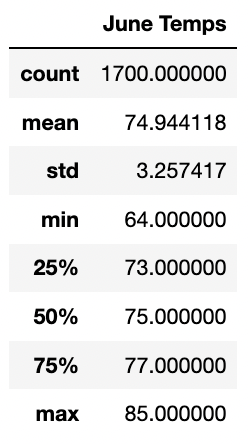
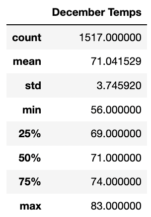

# Surfs_up Analysis
## Overview:
- The purpose of this analysis was to provide climate data to an investor for a business plan to open up an ice cream and surf board shop in Oahu, Hawaii.

## Results:
- Our business partner asked us to put together some data related to the temperatures of Oahu for the months of June and December over a span of years. Using Jupyter notebook, the Pandas library, and SqlAlchemy, we extracted data from our business partner's sqlite file and put together a statistical analysis for the potential investors. Below are the statistical results for both June and December, respectively. 

**June Temps Statistics**

**December Temps Statistics**

## Summary:
- Both months that we are analyzing have a decent sample size, with at least over 1500 data samples to help provide helpful information about the temperature of Oahu in June and December. June shows an average temperature of about 75 degrees and December shows an average temperature of about 71 degrees, which are both fair temperatures for outdoor activities. Both statistical results show a standard deviation between 3 and 4, which means the data is more reliable as the majority of the data occurs closer to the mean/average. The min and max temperatures for June are 64 degrees and 85 degrees, respectively. While the min and max temperatures for December are 56 degrees and 83 degrees, respectively. From the statistics for both June and December, we can see both months are relatively similar regarding temperatures, with the exception that December has the potential to be a bit cooler. It seems that both months could be pretty lucrative regarding the surf side of the business, but could potentially be a little slower regarding the ice cream side in December. While this does give us some insight into how well a surf and ice cream shop could perform, more analyses could provide a stronger argument to help potential investors feel more secure about their investment. Below are some more recommendations for what other analyses could be helpful.
    - Additional Recommended Queries:
        - Recommendation 1: A query that provides information regarding the occurrence of precipitation for the months of June and December.
        - Recommendation 2: A query that provides other weather information such as humidity, cloudiness, or wind conditions for both months.
        - Recommendation 3: Query other months to get a better idea of how the business would perform throughout the year. This could also give insight to both the coldest and hottest months, which could affect the performance of the business.
        
    - Additional Data Gathering Recommendations:
        - Gather data on competition. See how many other businesses that provide ice cream sales and surf product sales/rentals.